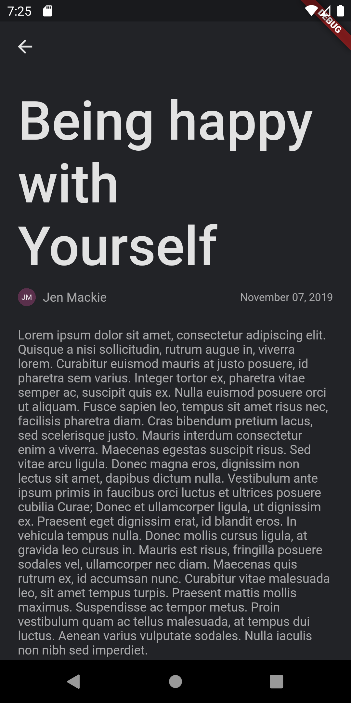

# Flutter Community Application Template (FCAT)

This is a simple, extendable mobile application template, specifically for Communities that would like an app for their services.

It currently contains the following features:

- Events Calendar
- Articles
- Feed
  - Currently is the almagamation of Articles and events and anything else
  
And the following object models:

- Event
- Article
- DateTimeObject
  - Objects that largely depend on their DateTime

## Screenshots

Feed Page showing Event Objects and Article Objects

Event Objects get grouped and organized by day

While Artcle and Event Objects on the feed, are grouped into month-year pairs

Calendar Page Showing Calendar Widgets and Events

Calendar Widget Expanded

Opened Event with a fallback color

An Opened Event would show the event title, date, content and image or a fallback image or color

Articles Page sgowing Article Objects

Each Article Object shows the Article post date, the author, the title and a preview of the content

Opened Article

Showing all the information concerning the article

User Info Dialogue

Show When a User's image is clicked

This user was the author of one of the articles on the article page
